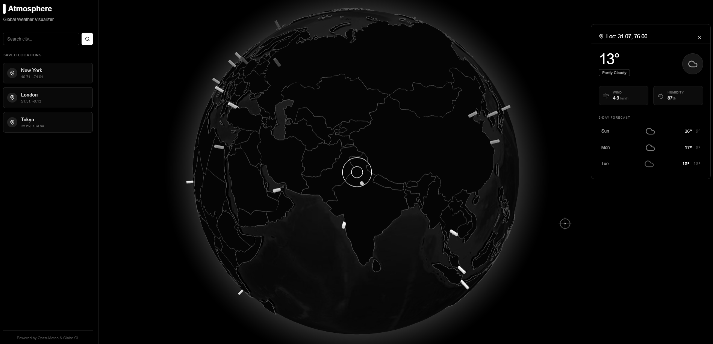

<div align="center">

```txt
                                                                                                       
  ,---.    ,--.                                 ,--.                                 ,----. ,------.   
 /  O  \ ,-'  '-.,--,--,--. ,---.  ,---.  ,---. |  ,---.  ,---. ,--.--. ,---. ,-----.'.-.  ||  .-.  \  
|  .-.  |'-.  .-'|        || .-. |(  .-' | .-. ||  .-.  || .-. :|  .--'| .-. :'-----'  .' < |  |  \  : 
|  | |  |  |  |  |  |  |  |' '-' '.-'  `)| '-' '|  | |  |\   --.|  |   \   --.       /'-'  ||  '--'  / 
`--' `--'  `--'  `--`--`--' `---' `----' |  |-' `--' `--' `----'`--'    `----'       `----' `-------'  
                                         `--'                                                               
```

### 🌧️ **Atmosphere 3D**
**A minimalist, interactive 3D weather visualization application built with React and Globe.GL. This project renders a monochrome 3D globe, allowing users to explore real-time weather data and forecasts for any location on Earth using the Open-Meteo API.**  

---


[](https://atmosphere-3d-ten.vercel.app/)

</div>

---



## Features

-   **Interactive 3D Globe**: A high-performance WebGL globe featuring vector-based continent outlines and a monochrome aesthetic.
-   **Real-time Weather Data**: Click anywhere on the globe or landmasses to fetch current weather conditions (temperature, humidity, wind speed, weather code).
-   **Global Heatmap**: Visualizes temperature data for major global cities using color-coded points on the globe surface.
-   **Location Search & Favorites**: Search for any city worldwide and save it to a quick-access sidebar.
-   **Forecasts**: Displays a 3-day weather forecast summary for selected locations.
-   **Modern UI**: Built with a custom dark mode design system inspired by ShadCN/UI, featuring glassmorphism effects and custom cursors.
-   **Responsive**: Fully responsive design that works on desktop and mobile devices.

## Tech Stack

-   **Framework**: [React 18](https://react.dev/)
-   **Build Tool**: [Vite](https://vitejs.dev/)
-   **3D Visualization**: [Globe.GL](https://globe.gl/) (Three.js wrapper)
-   **Styling**: [Tailwind CSS](https://tailwindcss.com/) & [clsx](https://github.com/lukeed/clsx)
-   **Icons**: [Lucide React](https://lucide.dev/)
-   **Data Fetching**: [Axios](https://axios-http.com/)
-   **API**: [Open-Meteo](https://open-meteo.com/) (Free, no API key required)

## Prerequisites

Before you begin, ensure you have the following installed:
-   [Node.js](https://nodejs.org/) (v16 or higher)
-   npm or yarn

## Installation & Setup

1.  **Clone the repository**
    ```bash
    git clone https://github.com/dhevenddra/atmosphere-3d.git
    cd atmosphere-3d
    ```

2.  **Install dependencies**
    ```bash
    npm install
    ```

3.  **Run the development server**
    ```bash
    npm run dev
    ```

4.  **Open the app**
    Open your browser and navigate to `http://localhost:5173` (or the port shown in your terminal).

## Project Structure

```
├── src/
│   ├── components/
│   │   ├── ui/               # Reusable UI primitives (Button, Card, Input, etc.)
│   │   ├── GlobeVisualization.tsx # Main 3D Globe logic
│   │   ├── WeatherCard.tsx   # Weather details overlay
│   │   └── Sidebar.tsx       # Navigation and search sidebar
│   ├── services/
│   │   └── api.ts            # Open-Meteo API integration
│   ├── types.ts              # TypeScript interfaces
│   ├── App.tsx               # Main application layout
│   └── main.tsx              # Entry point
├── index.html
├── package.json
└── vite.config.ts
```

## Customization

-   **Globe Appearance**: Modify `src/components/GlobeVisualization.tsx` to change colors, altitude, or polygon styles.
-   **Major Cities**: Update the `MAJOR_CITIES` array in `src/services/api.ts` to change the initial data points on the globe.
-   **Theming**: The app uses CSS variables for theming in `index.html` and Tailwind utility classes.

## License

This project is open-source and available under the [MIT License](LICENSE).
